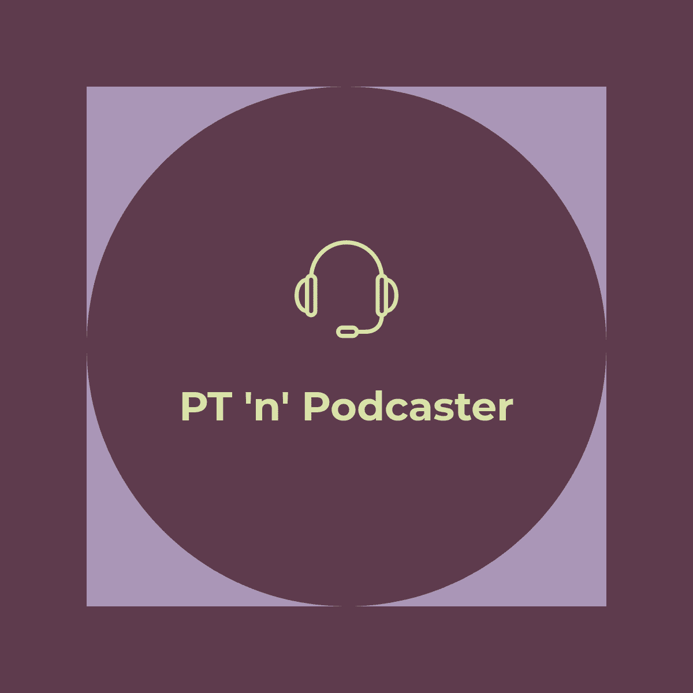
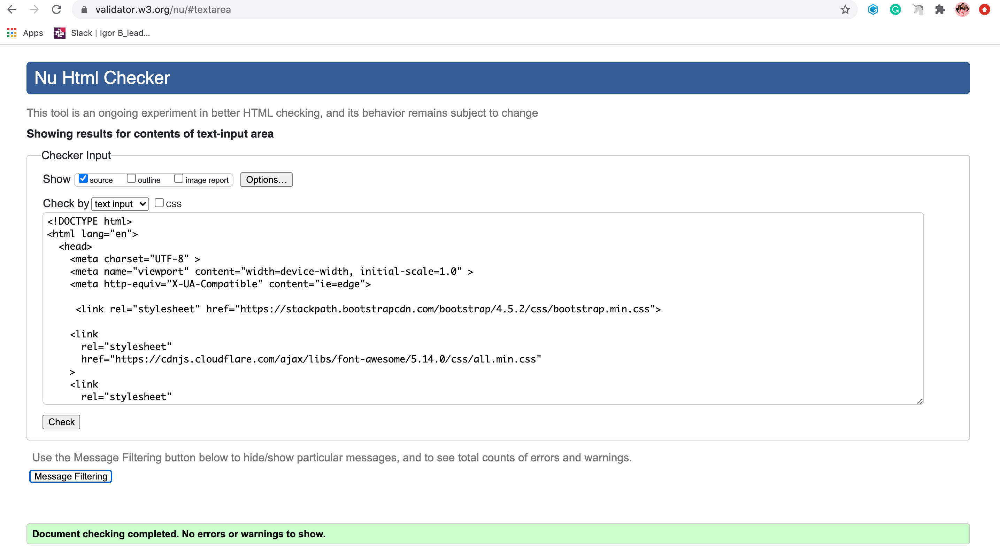
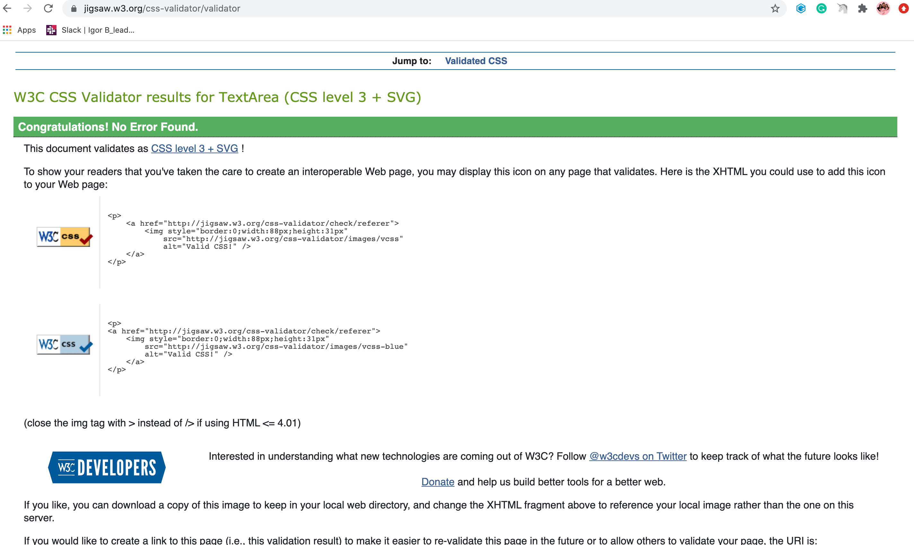
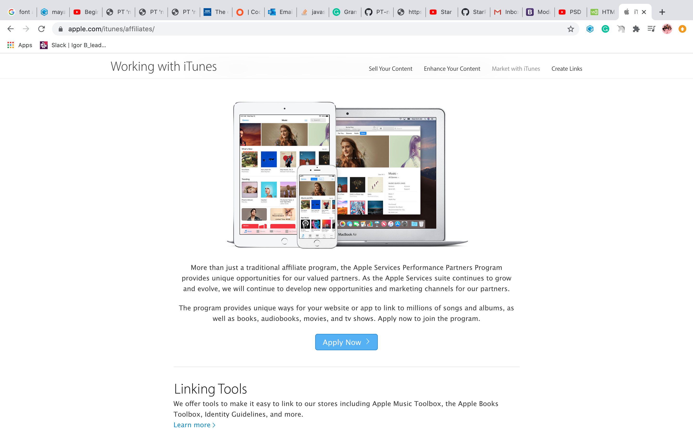
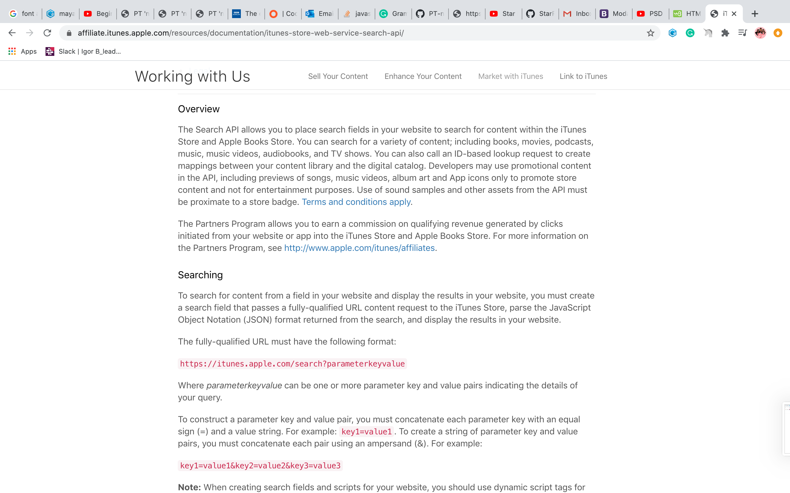

# PT'n' Podcaster



Thank you for visiting my project. This website is a clear and concise projection of my career and passion. I am a female-only level 4 pre and postnatal Personal Trainer and I love podcasting. After founding and hosting the tried it podcast, I went on to launch Mayas minutes and guest on countless other podcasts. I use my social media pretty heavily, but when you are relying on a mass-produced algorithm you can never really portray the true essence of who you are and what you do, this website is me doing just that! _if you have any questions or suggestions head to my Github contact details._

## Contents

1. **UX** 👨‍💻
2. **Goals**
3. **Structure and Wireframe Mockups**
4. **Design**
5. **Technologies**
6. **Features**
7. **Testing**
8. **Bugs**
9. **Deployment**
10. **Credits & Acknowledgements**

## UX (User Experience) :control_knobs:

#### User Stories:

- As a user, I expect to find information about how experienced my new (potential) Personal Trainer is.. **especially as I am pregnant**.
- As a user and upcoming podcaster, I want to be inspired by more experienced podcasters, I want _quick and easy access to their work_.
- As a user, suffering from **Diastasis Recti** I just want to _book and pay for sessions as soon as possible_.
- As a user, I want to **lighten my load** and know if a 'podcaster' has _other audio technology-related skills_.
- As a user, I want to be able to _register my interest in any service quickly and easily_.

#### User Stories (in detail) :clipboard:


#### Amiko Powsen (23/ female):

> I am terrified! I am about to have a baby and, my body is changing and I feel powerless! I want to feel reassured by a professional who can help me feel that I can hold onto some of my identity! I want my trainers' website to be inviting but factual.

#### Sonnie Dosanjh (20/ Male):

> I have recently graduated as a sound engineer from Leeds uni. I have found that supporting podcasters is a great way of building work experience. I want to be able to easily reach out to a potential podcaster not just to support them, but learn from their accumulated editing skills.

#### Josie Benson (36/ female):

> I know exactly what I need and when I have found a trainer that can provide it, I want to be able to book their services quickly and easily, if possible, without putting my bank details in, as I can never find my card!!

### Project Goals

The goal of this project is to create a more interactive and specific version of my current website. Since the design of my first website I am a lot more tech-savvy and experienced and feel it is important that this shines through. I would like to create an **online extension of my PT business and podcasting skills**. The website is aimed toward women seeking Pre and postnatal specialist fitness support and anyone seeking my input on their podcast. I have used this project as an opportunity to collate all of the skills that I have developed in my experience in both fields and aim to make this website extremely easy to use and interactive enough for the user to feel that the information they wanted was easy to source. **I am paying close attention to the wording and language** as Pre and Post Natal exercise is still relatively new and sometimes intimidating for women, its deeply important that I do not make women feel that exercising during or thereafter their pregnancy should be prioritised over the other practical things they must do, rather as part of their self-care.

#### Site Owner Goals:

- Promote me as a specialised Personal Trainer and Podcaster.
- Generate a stream of new clients.
- Provide enough information on the site to entice the types of clients with whom my expertise are best suited.
- Display my credentials in a clear and concise format.
- Inspire my clientele to lead a healthier lifestyle for the right reasons, as opposed to body shaming them into trying to get fit.
- Display all of my Podcasting experience in an interactive and easily attainable way.
- Ensure that the site is aesthetically pleasing.

## Design Choices: 🎨

##### Structure

The site is a scrolling and multiple pages site with 3 sections on the homepage; 3 separate pages for the PT section, 1 separate page for the Podcast section, a separate page for 'About me' and a separate page for FAQ. Originally I opted for a scrolling site, however when I realised how much content I needed to put on the site, to try and messily limit it to a scrolling site would have made the site look rushed, unprofessional and contribute to bad user experience.

In my opinion, the site is still very accessible and gives the user the freedom to venture into the aspects that they are interested in, with a click and those who know exactly what they are looking for can easily navigate to the relevant pages.

##### Colour scheme

I wanted the colour scheme of this project to elicit emotions of; motivation; conversation and health. To achieve this difficult blend of emotions, I needed to carry out some research on the meanings and feelings associated with certain colours.
I knew vaguely that green was associated with health because of new beginnings and seasonal indications from the spring months, but had no idea how best to convey the conversational aspect of my site. I found <a href='https://www.templatemonster.com/blog/warm-cool-color-psychology-web-design/'>this</a> blog post, which explained that purple had soothing sensual and imaginative! It is also aesthetically very professional when placed with a range of other colours. To decide on what the other range of colours should look like, i turned to Pinterest for some <a href='https://www.pinterest.co.uk/shamastock/wellness-color-palette-ideas/'> inspiration </a> I then used <a href= 'https://coolors.co/'>coolors.co</a> to help me find a fitting colour scheme, incorporating all the emotions i desired. A screenshot of the colour scheme can be found <a href="assets/logos/palette.pdf">here.</a>

##### Logo:

I decided to base my logo around the colour purple and then allow this to help me decide on the entire colour scheme. To design the temporary logo I used <a href="https://hatchful.shopify.com/"> Hatchful.shopify.com</a> . Although this gave me a limited scope for design, I was able to use this tool to decide on a key image/ icon which ties both PT and Podcasting together... Headphones-they are instantly associated with exercise and also audio. I played around and came up with the logo you can at the top of this page. Alternatively the logo can be found <a href="assets/logos">here </a> Along with a screenshot of the creation process. I believed the logo should equally signify the importance of both of the skills I am using the website to advocate.

##### Fonts:

I chose to use the fonts <a href= <a href="https://fonts.googleapis.com/css?family=Roboto&display=swap">ROBERTO</a> After looking at other fitness/ wellness websites, I found the two fonts regularly appearing and realised that it was probably because they are easy to read and also have the scope to be pretty impactful.

##### Colours:

I wanted the colours to vary but also show continuity, this is why I opted for two main colours   'sage' and 'cultured-#edf2ef' then I used the colours provided by the colour scheme generated in coolor to choose colours for the tags and text.  I thought with subtle bursts of colour I could retain the user's attention and not overwhelm them with too many stimuli. I used ' dark slate gray' throughout the PT pages and 'Vermillion" on the PT section on the homepage.  I used 'Onyx' as the font colour, on all the pages with 'cultured' as the background colour because I felt black was too harsh and the slightly different 'Onyx' set the text and background colours off nicely.

## Wireframes: 🔧

I built the wireframes for this project using <a href="https://balsamiq.com/">Balsamiq mockups</a>. In my previous project, I did not adequately plan my project, this time I wanted to utilise the benefits of setting out my plan in detail, it saved me so much time and gave me a lot more freedom to try out different ideas, should I need to!
View my wireframes <a href=" ">here.</a>

## Features: 🎡

- Map with markers
- Interactive animations (Outdoor in-home and virtual training on index.html)
- search box for topics I've spoken on (podcast section)
- Star rating and review box
- Personal Training rates which illuminate on hover and return to the original background colour on mouse leave.
- Scroll to top button.


## Technologies Used: 👨‍💻

### Languages:

- <a href="https://developer.mozilla.org/en-US/docs/Web/HTML">HTML</a>
- <a href="https://developer.mozilla.org/en-US/docs/Web/CSS">CSS</a>
- <a href="https://www.w3schools.com/js/">JavaScript</a>
- <a href="https://developers.google.com/maps/documentation/javascript/overview">Google Maps </a>
- <a href="https://www.emailjs.com/"> Email Js </a>

### Tools & Libraries:

- <a href="https://jquery.com/">jQuery</a>
- <a href="https://popper.js.org/">Popper js</a>
- <a href="https://git-scm.com/">Git</a>
- <a href="https://getbootstrap.com/">Bootstrap</a>
- <a href="https://fontawesome.com/icons?d=gallery">Font-Awesome</a>
- <a href="https://validator.w3.org/">W3C Validation service was used to check HTML. </a> 

- <a href="https://jigsaw.w3.org/css-validator/">W3C Markup validation services used to check CSS.</a> 

- <a href="https://jshint.com/">Js Hint Validation service. </a>

## Testing: 🔌

Test Planning:
I was very concerned with the functionality of my site and needed features such as my PT enquiry form, Podcast enquiry form and star rating to work seamlessly.
Especially because these forms and features could potentially lose me a new client if the user felt dissatisfied with the functionality, or potential podcast sponsorship if my content isn't accessible. 

Testing Stories:
- I continued to test the forms' function throughout the process and quickly realised that whilst the code I had used from my template js email was correct, I had used slightly ineffective code in my email.js file and corresponding HTML, because every time I tried to use the function to test it, I would not receive an email and it would refresh my details every time. After an in-depth explanation from my mentor, I learnt that the 'onsubmit' action had built-in functions when if not accompanied by a return false action, meant that my code was being asked to send the form and refresh, virtually at the same time. Hence why I was not receiving the email and the form was refreshing details on every attempt.

I fixed this issue, by using the source option in dev tools, to look at where the code became unresponsive and found that I had placed a comma in the wrong place too!

After resolving these issues, I found that my PT enquiry form was working perfectly well!


-  The filter function only seemed to work if the function was placed in the HTML and not the actual script.js file. Whilst this was not an issue, I felt that if I have got a specific js file then surely all the script should go in there! I tried to make it work whilst in the script file, but I kept getting a  'filterFunction is not defined' error.

I fixed this issue after removing the function from the list of functions so that it was not inside my jQuery ```$(document).ready(function() {}```.

After resolving this issue, I found that my filter function was working perfectly well whilst IN my script.js.file!

- The star rating became a nightmare for me, I was using so many 'for loops' and wanted to try and take a shortcut by using nested for loop with the ```j-- ``` JavaScript decrement! This meant that I became stuck in an infinite loop and my confidence with javascript as a whole plummeted. 

I fixed the issue by talking through the loops as I wrote them and not allowing j=1 to scare me AND with the correct use of if and else statements!

After resolving this issue, I found that my star rating was working responsively!

Key aspects:
Design -

Plan 📝: One of my aims was for the cost of a personal training package to illuminate when the user hovers over the package.

Implementation 🏭: I tried to initially do this in my CSS, however, I could not target the correct elements effectively. I would have had to style quite a few 'a' elements and then 'a: hover' elements which would have in turn, meant that I would have had to target each specific 'a' element and making it individual would have been tough! I eventually, decided to use javascript and the 'mouseenter' and 'mouseleave' functions to add specific CSS and then remove it. Giving the appearance of a hover. I could also use 4 unique Id's on each PT page and only have to do the function for each id once within my script.js file because the ids were each on different pages.

Verdict ✅: It looks wonderful and I have the desired effect.


Plan 📝: Radio buttons on podcast email so that after choosing which type of enquiry you had, a text area would appear. Without this approach, it was likely to look messy and contribute to bad user experience. 

Bug 🕷: After clicking the radio button once it could not be unclicked, such is the design of radio buttons. Although, this made it very limiting for a potential user, if they mistakenly clicked an option, using javascript I had instructed the text area to appear, however, if they clicked another button another text area would appear and stick. 

Fix 🔧: I solved this by switching my radio buttons to checkboxes. These are a lot more functional for my purpose. 

Verdict ✅: The desired effect has been achieved.

# Known Bugs:
Here is a list of known bugs that exist on the site: ❌

- When the site is viewed on a device smaller than a laptop the navbar options appear on the opposite side of the navbar burger button. 
- Star rating flickers slightly whilst hovering over stars.


Features to implement in future changes:

- I would like to eventually be deemed as a profitable option for apple to share their podcast API with and then apply this to my site and create a carousel of my recent podcast episodes. I could not have this as an option for this project, because in order to use the apple podcasts API to promote your podcast you have to apply to become an affiliate.  . 
- I would like to have a chat now function, instead of just an email form.
- I would like to have a Paypal link beneath the relevant forms so that people could pay for services as soon as they select the package they would like.
- I would like to input a carousel which can update using a link to my various platform, specifically showing the upcoming projects/event that i am doing.
- I would like to use local storage to keep the star ratings and reviews on the page. 

## Deployment: 🚀

PT 'n' Podcaster was developed on GitPod, using git and GitHub to host the repository.

When deploying PT 'n' Podcaster using GitHub Pages the following steps were made:

- Opened up <strong>GitHub</strong> in the browser.
- Signed in using username and password.
- Selected my <strong>repositories</strong>.
- Navigated to <strong>'/mayasaffron/pt-n-Podcaster'</strong>.
- In the top navigation clicked <strong>'settings'</strong>.
- Scrolled down to the <strong>GitHub Pages</strong> area.
- Selected <strong>'Master Branch'</strong> from the <strong>'Source'</strong> dropdown menu.
- Clicked to confirm my selection.
- PT 'n' Podcaster is now live on GitHub Pages.

#### Running PT 'n' Podcaster Locally

Cloning PT 'n' Podcaster from GitHub:

- Navigate to <strong>'/mayasaffron/pt-n-Podcaster'</strong>.
- Click the green <strong>'Clone or Download'</strong> button.
- Copy the <strong>url</strong> in the dropdown box.
- Using your favourite <strong>IDE</strong> open up your preferred <strong>terminal</strong>.
- Navigate to your desired file location.
- Copy the following <strong>code</strong> and input it into your terminal to clone PT'n'Podcaster.

```git
 git clone https://github.com/mayasaffron/pt-n-podcaster
```

# <a href="https://mayasaffron.github.io/PT-n-Podcaster/">Live site </a>

## Closing Notes:

Developing this project has encouraged me to think methodically and prioritise what needs to be done, as opposed to the aesthetic changes that may seem more important! I have also employed much more independence when faced with issues which I'm sure is to do with the confidence I now have in my skills. I am really happy with the work I have produced.
## Credits: 💳

#### Project Structure
- Used <a href="https://www.youtube.com/watch?v=SJVCvnKM_lI">To create my back to top scroller. </a> 
- Used <a href="https://www.w3schools.com/howto/howto_js_filter_lists.asp">To create my filter search box. </a>

#### Design

- Used <a href="https://hatchful.shopify.com/your-logos">To design my logo.</a> 
- Used<a href="https://coolors.co/78e8b2-ff8552-dbd56e-f7b32b-f67e7d">To source my colour scheme.</a> 
- Used <a href="https://www.shutterstock.com/image-resizer">To resize my images.
</a>
